# Test-Driven Development (TDD)

## Overview

Plan the increment. Write the test first. Watch it fail. Get it confirmed and committed. Write minimal code to pass. Get that confirmed. Review it, then get the review confirmed and committed.

**Core principle:** If you didn't watch the test fail, you don't know if it tests the right thing. If your human partner didn't confirm a gate, you don't know they agree with the direction — proceeding anyway silently overrides their judgment.

**Violating the letter of the rules is violating the spirit of the rules.**

## When to Use

**Always:**
- New features
- Bug fixes
- Refactoring
- Behavior changes

**Exceptions (ask your human partner):**
- Throwaway prototypes
- Generated code
- Configuration files

Thinking "skip TDD just this once"? Stop. That's rationalization.

## The Iron Law

```
NO PRODUCTION CODE WITHOUT A FAILING TEST FIRST
NO ADVANCE PAST A GATE WITHOUT YOUR HUMAN PARTNER'S CONFIRMATION
```

Write code before the test? Delete it. Start over.

**No exceptions:**
- Don't keep it as "reference"
- Don't "adapt" it while writing tests
- Don't look at it
- Delete means delete

Implement fresh from tests. Period.

Skip a confirmation gate because "it's obviously fine"? That's the same rationalization as skipping the test. Stop and ask.

## Plan-Red-Green-Review

Four gates per feature increment: **PLAN** (design record), **RED** (failing test), **GREEN** (minimal implementation), **REVIEW** (inspect/refactor). Every gate ends with your human partner's explicit confirmation before you proceed to the next, and PLAN, RED, and REVIEW each end with their own commit right after that confirmation. GREEN alone has no commit — the GREEN code is committed only after REVIEW confirms it.

```dot
digraph tdd_cycle {
    rankdir=LR;
    plan [label="PLAN\nWrite plans/plan_<feature>.md", shape=box, style=filled, fillcolor="#ffe6cc"];
    confirm_plan [label="Confirm with\nhuman partner", shape=diamond, style=filled, fillcolor="#ffffcc"];
    commit_plan [label="COMMIT\nplan", shape=box, style=filled, fillcolor="#e0e0e0"];
    red [label="RED\nWrite failing test", shape=box, style=filled, fillcolor="#ffcccc"];
    verify_red [label="Verify fails\ncorrectly", shape=diamond];
    confirm_red [label="Confirm with\nhuman partner", shape=diamond, style=filled, fillcolor="#ffffcc"];
    commit_red [label="COMMIT\ntest", shape=box, style=filled, fillcolor="#e0e0e0"];
    green [label="GREEN\nMinimal code", shape=box, style=filled, fillcolor="#ccffcc"];
    verify_green [label="Verify passes\nAll green", shape=diamond];
    confirm_green [label="Confirm with\nhuman partner", shape=diamond, style=filled, fillcolor="#ffffcc"];
    review [label="REVIEW\nInspect & refactor", shape=box, style=filled, fillcolor="#ccccff"];
    confirm_review [label="Confirm with\nhuman partner", shape=diamond, style=filled, fillcolor="#ffffcc"];
    commit_review [label="COMMIT\nimplementation", shape=box, style=filled, fillcolor="#e0e0e0"];
    next [label="Next feature", shape=ellipse];

    plan -> confirm_plan;
    confirm_plan -> commit_plan [label="approved"];
    confirm_plan -> plan [label="changes\nrequested"];
    commit_plan -> red;
    red -> verify_red;
    verify_red -> confirm_red [label="yes"];
    verify_red -> red [label="wrong\nfailure"];
    confirm_red -> commit_red [label="approved"];
    confirm_red -> red [label="changes\nrequested"];
    commit_red -> green;
    green -> verify_green;
    verify_green -> confirm_green [label="yes"];
    verify_green -> green [label="no"];
    confirm_green -> review [label="approved"];
    confirm_green -> green [label="changes\nrequested"];
    review -> verify_green [label="stay\ngreen"];
    review -> confirm_review;
    confirm_review -> commit_review [label="approved"];
    confirm_review -> review [label="changes\nrequested"];
    commit_review -> next;
    next -> plan;
}
```



### PLAN - Write the Implementation Plan

Before writing any test code, create `plans/plan_<feature>.md` (kebab/snake-case slug for the feature, e.g. `plans/plan_spare_scoring.md`) in the `plans/` directory at the project root. Capture:

- **Behavior**: the one behavior this increment adds (not a feature list)
- **Test**: the test name and the assertion that will prove the behavior
- **Approach**: the minimal design for the GREEN step — signature, data shape, edge cases considered, what's deliberately deferred

This file is the design record for the increment — what your human partner reviews to approve the plan before any test exists.

<Good>
```markdown
# plans/plan_spare_scoring.md

## Behavior
A spare (two rolls in a frame totaling 10) adds the next roll's pins as a bonus to that frame's score.

## Test
`test_one_spare_adds_next_roll_as_bonus`: roll 5,5 (spare), then 3, then rest gutters -> score() == 16 (5+5+3 bonus + 3 counted again in frame 2 + 0s).

## Approach
Walk `_rolls` frame-by-frame with an index `i`. If `_rolls[i] + _rolls[i+1] == 10`, add `10 + _rolls[i+2]` and advance `i` by 2. Otherwise sum the two rolls and advance by 2. Strikes deferred to a later increment.
```
Names the one behavior, names the test, sketches the minimal approach — no more
</Good>

<Bad>
```markdown
# plans/plan_spare_scoring.md

Add scoring for spares, strikes, and the 10th frame, refactor Game to use a Frame class, and add input validation.
```
Bundles multiple behaviors into one increment — split into separate plan/RED/GREEN/REVIEW cycles
</Bad>

### Confirm PLAN

**MANDATORY gate. Do not write the test without it.**

Show your human partner the plan file's Behavior/Test/Approach. Wait for explicit approval before writing any test code. If they request changes, revise the plan and ask again.

### Commit PLAN

Once confirmed, commit the plan file alone — nothing else.

```bash
git add plans/plan_<feature>.md
git commit -m "PLAN: <feature>"
```

### RED - Write Failing Test

Write one minimal test showing what should happen, per the plan above.

<Good>
```typescript
test('retries failed operations 3 times', async () => {
  let attempts = 0;
  const operation = () => {
    attempts++;
    if (attempts < 3) throw new Error('fail');
    return 'success';
  };

  const result = await retryOperation(operation);

  expect(result).toBe('success');
  expect(attempts).toBe(3);
});
```
Clear name, tests real behavior, one thing
</Good>

<Bad>
```typescript
test('retry works', async () => {
  const mock = jest.fn()
    .mockRejectedValueOnce(new Error())
    .mockRejectedValueOnce(new Error())
    .mockResolvedValueOnce('success');
  await retryOperation(mock);
  expect(mock).toHaveBeenCalledTimes(3);
});
```
Vague name, tests mock not code
</Bad>

**Requirements:**
- One behavior
- Clear name
- Real code (no mocks unless unavoidable)

### Verify RED - Watch It Fail

**MANDATORY. Never skip.**

```bash
npm test path/to/test.test.ts
```

Confirm:
- Test fails (not errors)
- Failure message is expected
- Fails because feature missing (not typos)

**Test passes?** You're testing existing behavior. Fix test.

**Test errors?** Fix error, re-run until it fails correctly.

### Confirm RED

**MANDATORY gate. Do not proceed to GREEN without it.**

Show your human partner:
- The test code
- The failure output from Verify RED

Wait for explicit approval. "Looks good", "proceed", "go ahead" count. Silence does not. If they request changes, revise the test and re-verify RED before asking again.

### Commit RED

Once confirmed, commit the (still-failing) test alone — nothing else. This is a deliberate red-state commit; it records that the test existed and failed before any implementation did.

```bash
git add <test file>
git commit -m "RED: <feature> — failing test"
```

### GREEN - Minimal Code

Write simplest code to pass the test.

<Good>
```typescript
async function retryOperation<T>(fn: () => Promise<T>): Promise<T> {
  for (let i = 0; i < 3; i++) {
    try {
      return await fn();
    } catch (e) {
      if (i === 2) throw e;
    }
  }
  throw new Error('unreachable');
}
```
Just enough to pass
</Good>

<Bad>
```typescript
async function retryOperation<T>(
  fn: () => Promise<T>,
  options?: {
    maxRetries?: number;
    backoff?: 'linear' | 'exponential';
    onRetry?: (attempt: number) => void;
  }
): Promise<T> {
  // YAGNI
}
```
Over-engineered
</Bad>

Don't add features, refactor other code, or "improve" beyond the test.

### Verify GREEN - Watch It Pass

**MANDATORY.**

```bash
npm test path/to/test.test.ts
```

Confirm:
- Test passes
- Other tests still pass
- Output pristine (no errors, warnings)

**Test fails?** Fix code, not test.

**Other tests fail?** Fix now.

### Confirm GREEN

**MANDATORY gate. Do not proceed to REVIEW without it.**

Show your human partner the implementation and the passing test output. Wait for explicit approval before moving to REVIEW.

**No commit here.** The GREEN code is not committed yet — it gets committed after REVIEW, so the commit reflects reviewed (and possibly refactored) code rather than the first-draft implementation.

### REVIEW - Inspect, Refactor, Confirm, Commit

After GREEN is confirmed, review the implementation before it's committed:
- Remove duplication
- Improve names
- Extract helpers
- Compare against `plans/plan_<feature>.md` — does the implementation match the approach, and if it diverged, was that justified?

Keep tests green throughout — re-run after every change. Don't add behavior; REVIEW is cleanup, not a second feature.

**Confirm REVIEW**

**MANDATORY gate.** Show your human partner the reviewed/refactored code (or state plainly that no refactor was needed) plus the still-green test output. Wait for explicit approval before committing.

**Commit REVIEW**

Once confirmed, commit the implementation (and any refactor):

```bash
git add <implementation file>
git commit -m "GREEN: <feature> — implementation"
```

### Repeat

Next feature starts back at PLAN.

## Good Tests

| Quality | Good | Bad |
|---------|------|-----|
| **Minimal** | One thing. "and" in name? Split it. | `test('validates email and domain and whitespace')` |
| **Clear** | Name describes behavior | `test('test1')` |
| **Shows intent** | Demonstrates desired API | Obscures what code should do |

## Why Order Matters

**"I'll write tests after to verify it works"**

Tests written after code pass immediately. Passing immediately proves nothing:
- Might test wrong thing
- Might test implementation, not behavior
- Might miss edge cases you forgot
- You never saw it catch the bug

Test-first forces you to see the test fail, proving it actually tests something.

**"I already manually tested all the edge cases"**

Manual testing is ad-hoc. You think you tested everything but:
- No record of what you tested
- Can't re-run when code changes
- Easy to forget cases under pressure
- "It worked when I tried it" ≠ comprehensive

Automated tests are systematic. They run the same way every time.

**"Deleting X hours of work is wasteful"**

Sunk cost fallacy. The time is already gone. Your choice now:
- Delete and rewrite with TDD (X more hours, high confidence)
- Keep it and add tests after (30 min, low confidence, likely bugs)

The "waste" is keeping code you can't trust. Working code without real tests is technical debt.

**"TDD is dogmatic, being pragmatic means adapting"**

TDD IS pragmatic:
- Finds bugs before commit (faster than debugging after)
- Prevents regressions (tests catch breaks immediately)
- Documents behavior (tests show how to use code)
- Enables refactoring (change freely, tests catch breaks)

"Pragmatic" shortcuts = debugging in production = slower.

**"Tests after achieve the same goals - it's spirit not ritual"**

No. Tests-after answer "What does this do?" Tests-first answer "What should this do?"

Tests-after are biased by your implementation. You test what you built, not what's required. You verify remembered edge cases, not discovered ones.

Tests-first force edge case discovery before implementing. Tests-after verify you remembered everything (you didn't).

30 minutes of tests after ≠ TDD. You get coverage, lose proof tests work.

## Common Rationalizations

| Excuse | Reality |
|--------|---------|
| "Too simple to test" | Simple code breaks. Test takes 30 seconds. |
| "I'll test after" | Tests passing immediately prove nothing. |
| "Tests after achieve same goals" | Tests-after = "what does this do?" Tests-first = "what should this do?" |
| "Already manually tested" | Ad-hoc ≠ systematic. No record, can't re-run. |
| "Deleting X hours is wasteful" | Sunk cost fallacy. Keeping unverified code is technical debt. |
| "Keep as reference, write tests first" | You'll adapt it. That's testing after. Delete means delete. |
| "Need to explore first" | Fine. Throw away exploration, start with TDD. |
| "Test hard = design unclear" | Listen to test. Hard to test = hard to use. |
| "TDD will slow me down" | TDD faster than debugging. Pragmatic = test-first. |
| "Manual test faster" | Manual doesn't prove edge cases. You'll re-test every change. |
| "Existing code has no tests" | You're improving it. Add tests for existing code. |

## Red Flags - STOP and Start Over

- Code before test
- Test after implementation
- Test passes immediately
- Can't explain why test failed
- Tests added "later"
- Rationalizing "just this once"
- "I already manually tested it"
- "Tests after achieve the same purpose"
- "It's about spirit not ritual"
- "Keep as reference" or "adapt existing code"
- "Already spent X hours, deleting is wasteful"
- "TDD is dogmatic, I'm being pragmatic"
- "This is different because..."
- "The plan is obvious, skip the file"
- "Confirmation is a formality, I'll just proceed"
- "I'll commit RED and GREEN together to save a step"
- "REVIEW found nothing so no need to confirm before committing"

**All of these mean: Delete code. Start over with TDD.** (The last four mean: stop, go back to the gate you skipped, and get confirmation before continuing.)

## Example: Bug Fix

**Bug:** Empty email accepted

**PLAN** (`plans/plan_empty_email_validation.md`)
```markdown
## Behavior
submitForm rejects an empty (or whitespace-only) email with error "Email required".

## Test
`rejects empty email`: submitForm({ email: '' }) -> result.error === 'Email required'

## Approach
Add a guard at the top of submitForm: if email is missing/blank after trim, return { error: 'Email required' } before any other processing.
```

**Confirm PLAN** — human partner reviews the plan, approves.

**Commit PLAN**
```bash
git add plans/plan_empty_email_validation.md
git commit -m "PLAN: empty email validation"
```

**RED**
```typescript
test('rejects empty email', async () => {
  const result = await submitForm({ email: '' });
  expect(result.error).toBe('Email required');
});
```

**Verify RED**
```bash
$ npm test
FAIL: expected 'Email required', got undefined
```

**Confirm RED** — human partner reviews test + failure, approves.

**Commit RED**
```bash
git add form.test.ts
git commit -m "RED: empty email validation — failing test"
```

**GREEN**
```typescript
function submitForm(data: FormData) {
  if (!data.email?.trim()) {
    return { error: 'Email required' };
  }
  // ...
}
```

**Verify GREEN**
```bash
$ npm test
PASS
```

**Confirm GREEN** — human partner reviews implementation + passing output, approves. No commit yet.

**REVIEW**
Extract validation for multiple fields if needed; otherwise no changes. Tests still green.

**Confirm REVIEW** — human partner approves the reviewed code.

**Commit REVIEW**
```bash
git add form.ts
git commit -m "GREEN: empty email validation — implementation"
```

## Verification Checklist

Before marking work complete:

- [ ] Every new function/method has a test
- [ ] A `plans/plan_<feature>.md` exists for each increment, written before its test
- [ ] Human partner confirmed PLAN before any test was written
- [ ] PLAN commit made (plan file alone) right after that confirmation
- [ ] Watched each test fail before implementing
- [ ] Each test failed for expected reason (feature missing, not typo)
- [ ] Human partner confirmed RED before GREEN started
- [ ] RED commit made (test file alone) right after that confirmation
- [ ] Wrote minimal code to pass each test
- [ ] All tests pass
- [ ] Human partner confirmed GREEN before REVIEW started
- [ ] REVIEW performed (refactor or explicit "nothing to change")
- [ ] Human partner confirmed REVIEW before committing
- [ ] REVIEW commit made (implementation) right after that confirmation
- [ ] Output pristine (no errors, warnings)
- [ ] Tests use real code (mocks only if unavoidable)
- [ ] Edge cases and errors covered

Can't check all boxes? You skipped TDD. Start over.

## When Stuck

| Problem | Solution |
|---------|----------|
| Don't know how to test | Write wished-for API. Write assertion first. Ask your human partner. |
| Test too complicated | Design too complicated. Simplify interface. |
| Must mock everything | Code too coupled. Use dependency injection. |
| Test setup huge | Extract helpers. Still complex? Simplify design. |

## Debugging Integration

Bug found? Write failing test reproducing it. Follow TDD cycle. Test proves fix and prevents regression.

Never fix bugs without a test.

## Testing Anti-Patterns

When adding mocks or test utilities, read [testing-anti-patterns.md](testing-anti-patterns.md) to avoid common pitfalls:
- Testing mock behavior instead of real behavior
- Adding test-only methods to production classes
- Mocking without understanding dependencies

## Final Rule

```
Production code → test exists and failed first
Every gate (PLAN, RED, GREEN, REVIEW) → human partner confirmed before proceeding
PLAN confirmed → commit plan alone
RED confirmed → commit test alone
REVIEW confirmed → commit implementation
Otherwise → not TDD
```

No exceptions without your human partner's permission.
